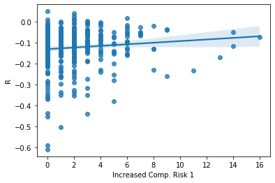
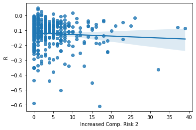
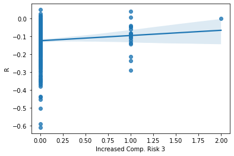
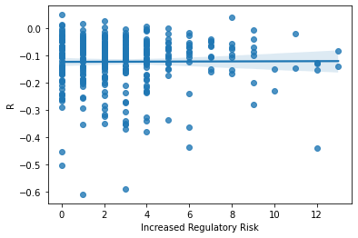
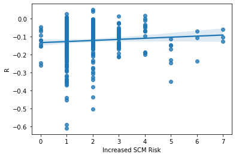

```python
import random
from tqdm import tqdm
import pandas as pd
from bs4 import BeautifulSoup
import re
from near_regex import NEAR_regex
import requests
import os 
import glob
from io import BytesIO
from zipfile import ZipFile
from urllib.request import urlopen
import seaborn as sns
import matplotlib.pyplot as plt 


```


```python
sample2_csv = 'outputs/sp500_accting_plus_textrisks.csv'

sample2 = pd.read_csv(sample2_csv)
```


```python
SP_Mr9_Rtn_csv = 'outputs/sp500_plus_risks_and_ret.csv'
SP_Mr9 = pd.read_csv(SP_Mr9_Rtn_csv)
```

## Risk Measurements

The three risk measurements I decided to use to test the sample of S&P 500 companies was: Increased Competition, Regulatory Pressure, and Supply Chain Disruptions. Increased Competition was the first measurement I decided to use, so I came up with three different variations on how it could be measured. The first variation is parsing the 10ks searching for any instances where "increased", "increase" or "potential" was seen within 4 words of the words "competition" or 'competitor", my reasoning behind this is that usually increases in competition will negatively affect your business, so I wanted to see if there was any evidence to support this. The second variation was to search for any instances of the words "new", "entering", or "potential" within 3 words of "entrants", "firms" or "company", my reasoning for this is that sometimes firms may not want to mention increased competition directly, so they may use different words like these. The final variation of this measurement searched for "market share" within 7 words of "threaten", "decrease", or "threat" the goal of this variation was to search for any time where competition may be talked about in relation to negative effects for the company, such as a decrease in market share. The second risk measurement I decided to use was supply chain risk, I measure this by searching for the words "supply chain", "supplier", "suppliers", or "materials" within 5 words of "problem", "problems", "shortage", "disruption", "constraints" or "risk". I decided to use this measurement because in the past few years there have been ongoing supply chain disruptions and shortages. If a company has a lot of "hits" for this risk it may indicate that they are having issues getting all the raw materials they need from their suppliers, they are having quality issues with their suppliers, or they simply cannot get the supplies in a timely manner. The last measurement I chose to use was Regulatory Risk, so any firms that may be affected by a change in regulations. I measured this risk by searching for instances where "Regulatory", "Regulations", or "Regulation" were directly next to "strict", "new", "additional" or "harsh". Firms who have more exposure to regulatory risk may have to expend additional capital to keep up with a changing regulatory environment. This could range from things like being forced to sell a building in a foreign country, forced wage increases, additional expenditures on the company's footprint, and more. All of my risk measurements got sufficient hits in my opinion, my increased competition measurement had the least number of hits for each variation, but this is too be expected as it was broken into three different measures. My Supply Chain Disruption measurement and Regulatory Pressure measures both had a 25th percentile of at least one, meaning that over 75% of the firms I parsed through returned a hit. For each of my measures, the more hits a firm returns, theoretically the more exposed to that risk they should be. Unfortunately my measurements only take into account the number of times the risk was mentioned, they are not effected by any additional actions these firms took to address the risks, and therefor correlation may not be perfect. 
All of my measurements should have been created in a way that they only return a hit when the variable is being talked about in a way that it increases the risk. For example, when increase and competition are seen together, it is unlikely that they are talking about a decrease in competition. However, it is possible that when "market share" and "decrease" are seen together in the document that it is referring to a competitor's market share, and this would wrongly increase the measurement, although this variation had the lowest hits out of all my risk measures, so I am confident. 

## Examples of Hits:

1. "Increased competition could result in our lower vehicle unit sales, price reductions, revenue shortfalls, loss of customers and loss of market share, which may harm our business, financial condition and operating results." --> This is an example of a hit from Tesla's 10k, it is a good hit because it shows that Tesla is exposed to this risk.

1. "For example, productivity across our fulfillment network currently is being affected by global supply chain constraints and constrained labor markets, which increase payroll costs and make it difficult to hire, train, and deploy a sufficient number of people to operate our fulfillment network as efficiently as we would like. " --> A supply chain measurement hit

1. "We currently are subject to, and may become subject to additional, regulations and compliance requirements (including obligations to implement enhanced authentication processes that could result in significant costs and reduce the ease of use of our payments products), as well as fraud."  --> A regulatory risk hit referring to how their business could be negatively affected by additional regulations


## Examples of good misses:

1. "We also intend to further increase cost-competitiveness in our significant markets by strategically adding local manufacturing, including at Gigafactory Berlin in Germany and Gigafactory Texas in Austin, Texas, which will begin production in 2022." --> This statement from a 10k has both the words Increase and Competitiveness, but it is not referring to a competitor in their market, so it would be a mistake if this was returned as a hit.


1. "We earn tradable credits in the operation of our automotive business under various regulations related to zero-emission vehicles, greenhouse gas, fuel economy and clean fuel. We sell these credits to other regulated entities who can use the credits to comply with emission standards and other regulatory requirements." --> This is also a miss, it refers to regulations, but in a way that benefits the companies.


```python
print(SP_Mr9.describe())
```

                    CIK  Increased Comp. Risk 1  Increased Comp. Risk 2  \
    count  3.550000e+02              352.000000              352.000000   
    mean   7.682979e+05                2.099432                4.653409   
    std    5.608935e+05                2.452698                5.827950   
    min    1.800000e+03                0.000000                0.000000   
    25%    9.348300e+04                0.000000                1.000000   
    50%    8.747160e+05                1.000000                3.000000   
    75%    1.136881e+06                3.000000                7.000000   
    max    1.792044e+06               16.000000               39.000000   
    
           Increased Comp. Risk 3  Increased Regulatory Risk  Increased SCM Risk  \
    count              352.000000                 352.000000          352.000000   
    mean                 0.056818                   2.855114            1.784091   
    std                  0.243804                   2.648233            1.176201   
    min                  0.000000                   0.000000            0.000000   
    25%                  0.000000                   1.000000            1.000000   
    50%                  0.000000                   2.000000            1.000000   
    75%                  0.000000                   4.000000            2.000000   
    max                  2.000000                  13.000000            7.000000   
    
                   gvkey       lpermno        fyear          sic  ...      prof_a  \
    count     355.000000    355.000000   355.000000   355.000000  ...  355.000000   
    mean    45305.952113  53570.729577  2018.884507  4320.836620  ...    0.151314   
    std     61170.060945  30143.136238     0.320067  1946.653427  ...    0.074428   
    min      1045.000000  10104.000000  2018.000000   100.000000  ...   -0.323828   
    25%      6286.000000  19531.500000  2019.000000  2844.000000  ...    0.102413   
    50%     13700.000000  58683.000000  2019.000000  3760.000000  ...    0.138699   
    75%     61582.500000  82620.000000  2019.000000  5455.500000  ...    0.186883   
    max    316056.000000  93436.000000  2019.000000  8742.000000  ...    0.390384   
    
                ppe_a      cash_a       xrd_a      dltt_a  invopps_FG09  sales_g  \
    count  355.000000  355.000000  355.000000  355.000000    334.000000      0.0   
    mean     0.247454    0.126002    0.031169    0.296568      2.698513      NaN   
    std      0.218987    0.138469    0.050173    0.181230      2.107435      NaN   
    min      0.009521    0.002073    0.000000    0.000000      0.405435      NaN   
    25%      0.091581    0.031900    0.000000    0.177941      1.234730      NaN   
    50%      0.162561    0.072171    0.009526    0.285137      2.155533      NaN   
    75%      0.336729    0.166690    0.042936    0.390672      3.301717      NaN   
    max      0.928562    0.694612    0.336795    1.071959     12.164233      NaN   
    
                 dv_a  short_debt           R  
    count  355.000000  349.000000  350.000000  
    mean     0.025464    0.112481   -0.123394  
    std      0.026991    0.111168    0.095211  
    min      0.000000    0.000000   -0.610145  
    25%      0.000000    0.028043   -0.154969  
    50%      0.020454    0.084992   -0.103884  
    75%      0.037617    0.151231   -0.062951  
    max      0.138594    0.761029    0.048830  
    
    [8 rows x 44 columns]


## Final Sample (Above)
I don't believe there are any real caveats in this data, however some columns are have missing data, including all my risk measures missing 3 rows. The reason for this, I believe, is that some firms were missing 10k's and because of this they could not be parsed for hits. It is also worth noting that there are 2-5 firms in the dataset that have return data, but not data on my risk measurements. 

## Plots and Correlation


```python
ax = sns.regplot(x= SP_Mr9['Increased Comp. Risk 1'], y = SP_Mr9['R'])

```


    

    


Unfortunately, this graph shows little to no relation between my first variation of increased competition risk measures and returns. This could be because my measures did not include enough words. 


```python
ax = sns.regplot(x= SP_Mr9['Increased Comp. Risk 2'], y = SP_Mr9['R'])
```


    

    


Out of all my graphs, this one has the strongest correlation to negative returns, however it is still weak. This measurement also returned the most hits out of my 3 variations of increased competition risk. 


```python
ax = sns.regplot(x= SP_Mr9['Increased Comp. Risk 3'], y = SP_Mr9['R'])
```


    

    


This measurement was much more hit or miss, and thus also has no real correlation.


```python
ax = sns.regplot(x= SP_Mr9['Increased Regulatory Risk'], y = SP_Mr9['R'])
```


    

    


Unfortunately, even though this measurment returned a lot of hits, there seems to be absolutely no relationship between the words I searched for an returns.


```python
ax = sns.regplot(x= SP_Mr9['Increased SCM Risk'], y = SP_Mr9['R'])
```


    

    


This graph is very spread out, once again suggesting that the way I measured Supply Chain risk does not correlate to returns


```python

```
